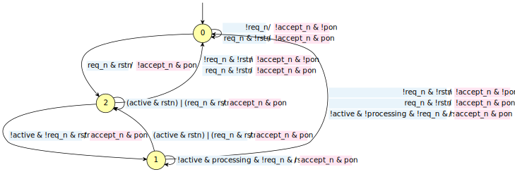
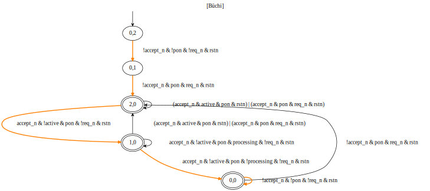
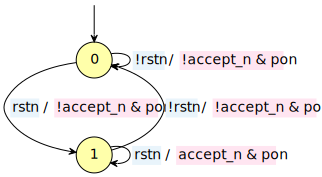
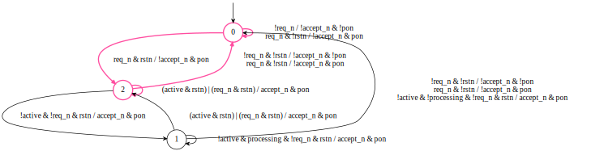

# Stuttering Simulation Equivalence
## Computing the stuttering simulation preorder and equivalence on Kripke structures or labeled transition systems

### Introduction
This work presents an example implementation of [1] for the formal verification of the Q-Channel protocol in hardware design. The previous approach relied on self-composition $A×A'$ and delay compensation structures to address the sleep behavior of module $A'$. However, this method resulted in scalability issues due to increased complexity arising from self-composition, delay compensation mechanisms, and a non-deterministic number of acknowledged sleep states. Additionally, the delay compensation logic scaled proportionally with the number of allowed sleep requests, introducing a finite limit. In contrast, the original implementations supported potentially infinite visits to the sleep state.

The stuttering simulation equivalence approach, based on weak bisimulation, offers a more efficient and scalable solution to this verification problem. By considering the sleep states as silent steps, or stutters, that do not change the outputs of the system, we can apply the weak bisimulation concepts to compare a model with sleep states to an equivalent model without these states.

The Q-Channel protocol serves as a practical example to illustrate the application of weak bisimulation in this context. By applying the stuttering simulation algorithm, we aim to verify that the model with sleep states executes the same steps and exhibits the same behaviors as the model without sleep states, invariantly.

### Implementation
The Stuttering Simulation Algorithm identifies bisimilar state relations, where for every path originating from one state, there exists a corresponding path from the other state that preserves the state labels, allowing for repeated consecutive labels (stuttering). We focus on stuttering bisimulation equivalence, which requires that the corresponding paths match each other's steps one-by-one while permitting stuttering. In this implementation, we utilize two models of the design, $A$ and $A_{stutter}$, to compute the bisimulation correspondence and refinement.

Stuttering bisimulation equivalence is applicable to a subset of Linear Temporal Logic (LTL) formulas. In the context of the Q-Channel protocol, we map the stuttering behavior of the model to the sleep behavior, which introduces "delays" without altering the output of the design. This is analogous to the stuttering effect in LTL formulas.

The algorithm follows these steps:

1. Compute the transition relation or the labeled transition system.
2. Initialize the $StSim$ set, which contains the stuttering candidates, i.e., states with the same atomic propositions.
3. Implement the function $pos(StSim(x), StSim(y))$, which returns the set of states in $StSim(x)$ that can reach a state in $StSim(y)$ through a path of states in $StSim(x)$.
4. Refine the $StSim$ set by removing all states that do not simulate stuttering/non-stuttering transitions.
5. Additionally, remove bisimilar transitions from $StSim$ that cannot be reached from the initial state, if they exist.

If the algorithm is correct and the Q-Channel protocol models are indeed equivalent under stuttering simulation, the resulting model should consist of only two states: `Q_EXIT` and `Q_RUN`. This would indicate that the sleep states introduced in the $A_{stutter}$ model do not alter the essential behavior of the system compared to the $A$ model without sleep states.

## Labelled transition system computation
For the sake of exemplification, Spot and Python are used to demonstrate the algorithm functionallity and also the SystemVerilog module from where the aiger files were derived.


```python
import spot
spot.setup()
from spot.jupyter import display_inline
import buddy
```

### SystemVerilog example of the Q-Channel protocol


```bash
! cat qchan.sv
```

### Transition system
For prototype purposes, we employ a labeled transition system (automaton) instead of the usual transition relation. This approach aids in visualizing the process. The input is an AIGER file, which is used to compute the automaton, providing access to all states and transition conditions.

The following code snippet demonstrates the conversion of an AIGER file to an automaton using the Spot LTL Python package:


```python
def labeled_trans_system(aiger):
    bdd_dict = spot.make_bdd_dict()
    model = spot.aiger_circuit(aiger, bdd_dict)
    aut = model.as_automaton()
    aut.merge_edges()
    return aut
```

The `spot.make_bdd_dict()` function creates a binary decision diagram (BDD) dictionary, which is a data structure used to efficiently represent and manipulate Boolean functions. BDDs are employed to encode the transition conditions and atomic propositions of the automaton, enabling compact storage and fast operations on the state space.

An automaton, in this context, is a mathematical model that represents a system's behavior. It consists of a set of states and transitions between those states, where each transition is labeled with a Boolean formula over atomic propositions. An atomic proposition is a statement that can be either true or false, and it represents a basic property or condition of the system at a given state.

The `spot.aiger_circuit()` function converts the AIGER file into an internal representation using the BDD dictionary. The `as_automaton()` method then transforms this representation into an explicit automaton object. Finally, the `merge_edges()` method is called to merge parallel edges between states, simplifying the automaton structure.

### Model with sleep states
The automaton showcases the implementation of the Q-channel protocol model incorporating sleep states. The design transitions to a sleep state when both `qreq_n` and `qaccept_n` are low, as depicted by the transition from state `1` to state `0`. In this sleep state, the power output `pow` is expected to be low; otherwise, it should remain high. The atomic propositions in blue represent the system inputs, while those in pink represent the system outputs.

It is worth noting that state `0` is designated as the initial state, as it lacks any incoming transitions. This initial state plays a crucial role in the system's behavior and serves as the starting point for any analysis or verification tasks.


```python
sleepy = labeled_trans_system("qchan.aig")
display(sleepy.show('.v'))
```


    

    


Spot can be employed to verify properties of the model. By developing a straightforward formal verification/model checking script, one can assess the _validity_ and _satisfiability_ of specific properties. The product of the automaton and a formula determines the _satisfiability_ of the property, akin to the concept of a "cover property" in SystemVerilog Assertions (SVA). Conversely, the product of the automaton and the *negation* of a formula establishes its _validity_, similar to an "assert property" in SVA.


```python
def show_run(product):
    run = product.accepting_run()
    run.highlight(2)
    print(run)
    display(product.show('v'))

def check_formula(system_model, formula_str, directive):
    if directive == "validity":
        formula = spot.formula.Not(spot.formula(formula_str))
    else:
        formula = spot.formula(formula_str)
    formula_automaton = formula.translate(dict=system_model.get_dict())
    product_automaton = spot.product(system_model, formula_automaton)
    if product_automaton.is_empty():
        if directive == "satisfiability":
            print(f"The path {formula} is unreachable.")
        else:
            print(f"The formula {formula_str} is an invariant of the system.")
    else:
        if directive == "satisfiability":
            print(f"Formula {formula_str} is reachable, here's a run:")
            show_run(product_automaton)
        else:
            print(f"Formula {formula_str} is not an invariant of the system, here's a counterexample:")
            show_run(product_automaton)
```

For instance, one can investigate whether the model exhibits a valid run in the context of the Q-channel protocol. Specifically, we can verify if the power on pon port can be deasserted when the model exits the *Q_STOPPED* state. This property holds significance in understanding the system's behavior during state transitions.


```python
formula = "(G(rstn)) &  \
            (!req_n & !accept_n & !pon) & \
            X(req_n & !accept_n & pon)"
check_formula(sleepy, formula, "satisfiability")
```

    Formula (G(rstn)) &              (!req_n & !accept_n & !pon) &             X(req_n & !accept_n & pon) is reachable, here's a run:
    Prefix:
      0,2
      |  !accept_n & !pon & !req_n & rstn
      0,1
      |  !accept_n & pon & req_n & rstn
      2,0
      |  accept_n & !active & pon & !req_n & rstn	{0}
      1,0
      |  accept_n & !active & pon & !processing & !req_n & rstn	{0}
    Cycle:
      0,0
      |  !accept_n & !pon & !req_n & rstn	{0}
    


    

    


Furthermore, it is possible to ascertain that the model consistently exits the sleep state whenever the system leaves the *Q_SLEEP* state. By verifying that this formula holds as an invariant of the model, we gain confidence in the correctness of the sleep state implementation. This approach demonstrates an alternative method of conducting formal verification using explicit state space exploration instead of relying solely on the transition relation.


```python
power_on = "G(!accept_n & req_n & !pon -> X(pon))"
check_formula(sleepy, power_on, "validity")
```

    The formula G(!accept_n & req_n & !pon -> X(pon)) is an invariant of the system.


### Model without sleep states
The automaton presented in this section represents the Q-channel protocol system without the inclusion of sleep states. Upon examination, it becomes evident that this model exhibits a reduced number of transitions and states compared to the previous automaton that incorporated sleep states. The valid sequence in this simplified model consists of a transition from state `0` to state `1`, followed by remaining in state `1` indefinitely unless the `!rstn` condition is encountered.


```python
reference = labeled_trans_system("qchan_no.aig")
display(reference.show('.v'))
```


    

    


## Stuttering Simulation
The following code is an extremely simplistic implementation of the Basic Stuttering Simulation Algorithm _BasicSSA_[1]. It basically partitions all the states that have the same labelling, and from here, the refinement of pairs is performed. For the sake of simplification, for this prototype, we categorise all states _x_ that simulates _y_ those in where the stuttering condition is part of the label and they don't modify the output behavior. Then we extract this model in AIGER format and perform equivalence checking between this model and the reference model, which does not accept stuttering (sleep) states.

In this section, we present a simplified implementation of the Basic Stuttering Simulation Algorithm (BasicSSA) [1] to compare the Q-channel protocol models with and without sleep states. The algorithm begins by partitioning all states that share the same labeling, forming the initial sets for refinement.

Let $S$ and $T$ denote the set of states in the models without and with sleep states, respectively. We define the labeling function $L$ that maps each state to its corresponding set of atomic propositions. The initial partition $P_0$ is formed by grouping states with identical labels, i.e., $P_0 = {{s ∈ S ∪ T | L(s) = L(t)} | t ∈ S ∪ T}$.

The refinement process iteratively splits the partition based on the stuttering simulation condition. For each pair of blocks $(B, C)$ in the partition, we check if there exists a state $x ∈ B$ and a state $y ∈ C$ such that $x$ simulates $y$ according to the stuttering condition. If no such pair is found, the block $B$ is split into two new blocks: one containing the states that can simulate states in $C$, and another containing the states that cannot.

The refinement process continues until a fixpoint is reached, i.e., no further splitting is possible. The resulting partition represents the stuttering simulation equivalence, where states in the same block are stuttering simulation equivalent.

By applying the BasicSSA algorithm to the Q-channel protocol models with and without sleep states, we can identify the states that are stuttering simulation equivalent. This allows us to perform equivalence checking and determine if the introduction of sleep states preserves the desired behavior of the system.


```python
def BasicSSA(model, st_model):
[...]
```

## Results
The Basic Stuttering Simulation Algorithm (BasicSSA) successfully identifies the sets of states $[(0, 0), (2, 0)]$ and $[(0, 2), (2, 2)]$ that bisimulate the transitions of the reference model without sleep states. The highlighted states in pink represent the transitions equivalent to those in the reference model, while the non-highlighted states indicate the additional logic introduced by the sleep states.

This approach offers several advantages. First, it reduces the complexity of the delay compensation mechanism by identifying the states that can be safely abstracted away without altering the essential behavior of the system. Second, it eliminates the restriction of using a finite number of continuous visits to the sleep state, as the state space exploration ensures that the inclusion of sleep states does not introduce any additional cost.

To further validate the results, we leverage the capabilities of the Spot library. By creating a new model using only the highlighted states obtained from the BasicSSA algorithm, we can generate an AIGER file representation of the reduced model. This AIGER file can be used for subsequent experiments in property checking and verification using HDL-supporting tools.


```python
BasicSSA(reference, sleepy)
```

    Running SSA


    

    


The stuttering bisimulation approach presented in this paper provides a powerful technique for comparing and simplifying models with and without sleep states. By identifying the stuttering simulation equivalence between states, we can confidently abstract away the sleep states while preserving the critical behavior of the system. This abstraction enables more efficient verification and analysis of stuttering systems such as the Q-channel protocol.

# References
[1] Ranzato, F., & Tapparo, F. (2009, September). Computing stuttering simulations. In International Conference on Concurrency Theory (pp. 542-556). Berlin, Heidelberg: Springer Berlin Heidelberg.

[2] Kant, G., Laarman, A., Meijer, J., Van de Pol, J., Blom, S., & Van Dijk, T. (2015). LTSmin: high-performance language-independent model checking. In Tools and Algorithms for the Construction and Analysis of Systems: 21st International Conference, TACAS 2015, Held as Part of the European Joint Conferences on Theory and Practice of Software, ETAPS 2015, London, UK, April 11-18, 2015, Proceedings 21 (pp. 692-707). Springer Berlin Heidelberg.
